# Streaming Service

TPE para la materia Redes de Información

# SRS

SRS es un servidor de audio y video simple y eficiente, que soporta:
- [RTMP (Real Time Messaging Protocol)](https://en.wikipedia.org/wiki/Real-Time_Messaging_Protocol)
- [WebRTC](https://es.wikipedia.org/wiki/WebRTC)
- [HLS](https://en.wikipedia.org/wiki/HTTP_Live_Streaming)
- [HTTP-FLV](https://es.wikipedia.org/wiki/Flash_Video)
- [SRT](https://en.wikipedia.org/wiki/Secure_Reliable_Transport)

Para una comparativa respecto de las distintas opciones soportadas, ver [aquí](https://github.com/ossrs/srs/wiki/v2_EN_RTMP.PK.HTTP#).

El repositorio se encuentra en [GitHub](https://github.com/ossrs/srs). Cuenta con 18.3k stars y 4.6k forks y es llevado a cabo principalmente por desarrolladores de China. Es por esto que muchas partes de la aplicación siguen en idioma Chino. Sin embargo, gran parte de la [documentación](https://github.com/ossrs/srs/wiki) se encuentra en inglés.

El proyecto lleva ya 9 años, y aún sigue activo.

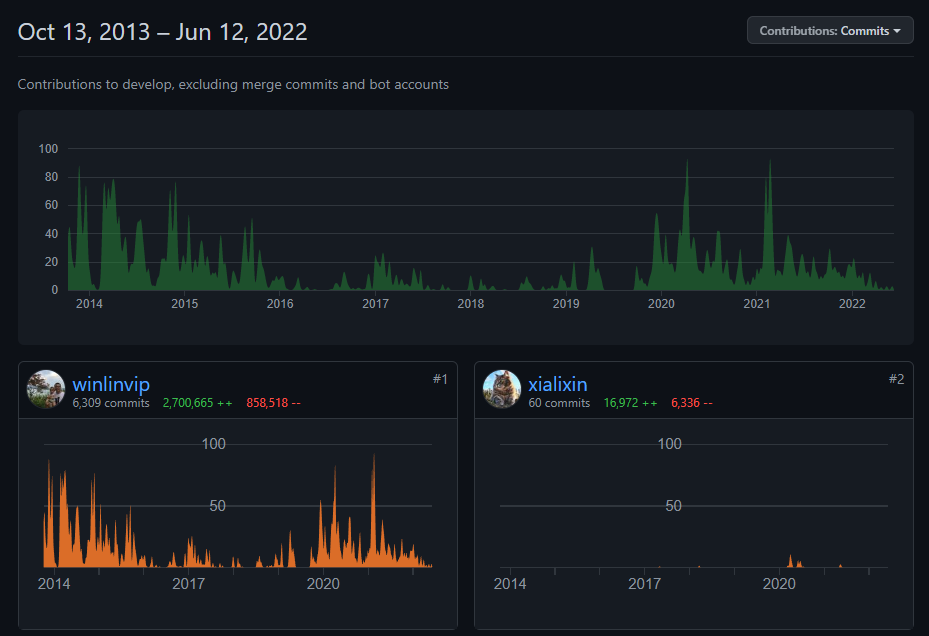

# Requisitos

## Docker

Para instalar Docker en Ubuntu, seguir la [guía de la documentación oficial](https://docs.docker.com/engine/install/ubuntu/).

# Configuración

Para la configuración, se utilizará el archivo `custom.conf`.

El archivo de configuración junto con anotaciones, es el siguiente:

```bash
# docker config for srs.
# @see full.conf for detail config.

# RTMP Port Protocol
listen              1935;
max_connections     1000;
# For docker, please use docker logs to manage the logs of SRS.
# See https://docs.docker.com/config/containers/logging/
srs_log_tank        console;
daemon              off;

# Internal API
http_api {
    enabled         on;
    listen          1985;
}

# HTTP Server
http_server {
    enabled         on;
    # Runs on port 8080
    listen          8080;
    dir             ./objs/nginx/html;
}

# WebRTC Server
rtc_server {
    enabled on;
    # Listening for UDP on port 8000
    listen 8000;
    # @see https://github.com/ossrs/srs/wiki/v4_CN_WebRTC#config-candidate
    # This should be the server IP
    candidate $CANDIDATE;
}

vhost __defaultVhost__ {
    # HLS Enabled to play M3U8 streams
    # Can be done querying: server-ip:8080/app/{stream-id}.m3u8 
    hls {
        enabled         on;
    }
    http_remux {
        enabled     on;
        mount       [vhost]/[app]/[stream].flv;
    }
    # WebRTC enabled through conversion from rtmp
    rtc {
        enabled     on;
        # @see https://github.com/ossrs/srs/wiki/v4_CN_WebRTC#rtmp-to-rtc
        rtmp_to_rtc on;
        # @see https://github.com/ossrs/srs/wiki/v4_CN_WebRTC#rtc-to-rtmp
        rtc_to_rtmp on;
    }
    # Digital Video Recorder to save files at rec directory+
    # This directory is then mounted with docker
    dvr {
        enabled      on;
        dvr_path     ./objs/nginx/html/rec/[app]/[stream]-[2006]-[01]-[02]_[15].[04].[05]_[999].mp4;
        dvr_plan     session;
    }
}

```

# Instalación

## Docker

En la carpeta `root` (donde se encuentra el archivo `custom.conf`), ejecutar la siguiente línea

```bash
# Server IP needs to be replaced
export SERVER_IP="Your.Server.IP"

docker run --rm -it -p 1935:1935 -p 1985:1985 -p 80:8080 \
-e CANDIDATE=$SERVER_IP \
-v "$PWD/.conf:/usr/local/srs/conf/custom.conf" \
-v "$PWD/rec/:/usr/local/srs/objs/nginx/html/rec/" \
--name srs ossrs/srs:4 ./objs/srs -c conf/custom.conf
```

## Local

Nos descargamos la configuración `custom.conf`, desde [aquí](https://raw.githubusercontent.com/mbaiges/streaming-service/main/custom.conf).

Clonamos el repositorio oficial de SRS y lo compilamos.

```bash
# Conseguimos la última version de SRS 
wget https://github.com/ossrs/srs/archive/refs/tags/v5.0.25.zip -O srs.zip
sudo apt install unzip
unzip srs.zip 
mv srs-5.0.25 srs
rm -rf srs.zip  

# Compilamos el proyecto
cd srs/trunk
./configure
make
```

Luego, colocamos el archivo de configuración `custom.conf` en el directorio `config`.

```bash
wget https://raw.githubusercontent.com/mbaiges/streaming-service/main/custom.conf -O conf/custom.conf
```

Y ejecutamos el servidor utilizando el comando

```bash
./objs/srs -c conf/custom.conf
```

## AWS 

El server SRS se puede levantar en una instancia EC2. 
Para intrucciones de configuración ver `aws_condig.md`

# Uso

De ahora en adelante, haremos referencia a la IP del servidor como `$SERVER_IP`.

## Publicar

Para publicar un stream de audio y video, utilizaremos el protocolo RTMP.

### OBS

Desde OBS, en la configuración `Settings`, en la sección de `Stream`, usaremos el Servicio `Custom` con el Servidor `rtmp://$SERVER_IP:1935/app/` y como llave para el stream, la que queramos. En este caso usaremos `mystream`. Es importante recordar la clave ya que se usará luego para acceder al stream.

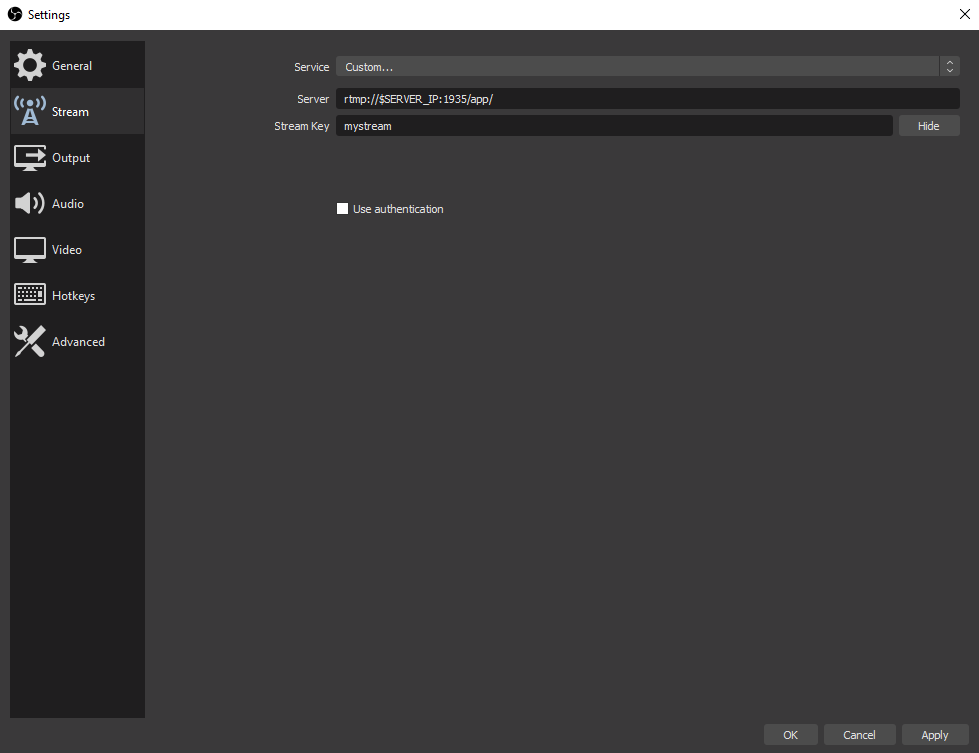

Luego, podemos iniciar el streaming, y se verá cuando se conectó al servidor en la parte inferior de OBS.

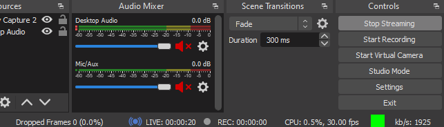

Se puede observar el cuadrado verde y la sección de `LIVE` indicando el tiempo de streaming.

### FFMPEG

Desde la herramienta `ffmpeg`, también podemos streamear. 
Un ejemplo es stremear un video en loop. Para el ejemplo, usaremos un video llamado `demo.flv`.

```bash
ffmpeg -stream_loop -1 -re -i ./demo.flv -c copy -f flv -y rtmp://$SERVER_IP/app/mystream
```

Si funciona correctamente, veremos una salida como la siguiente:

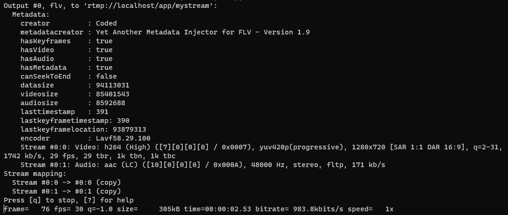

## Reproducir

Para reproducir el streaming, tendremos distintas formas de hacerlo.

### RTMP

Para acceder al streaming, podemos hacerlo mediante el servidor `RTMP`. Un caso de uso es con la herramienta `ffplay`, la cual utiliza las librerías de `ffmpeg`.

```bash
ffplay rtmp://$SERVER_IP/app/mystream
```

Al correr el comando, se reproducirá el stream.


### Desde la Web App de SRS

Al ingresar a `http://$SERVER_IP:8080`, nos encontraremos con el siguiente sitio.

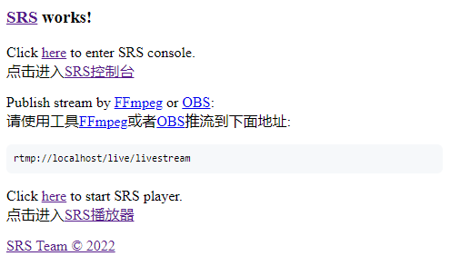

La página está en idioma Chino, pues el proyecto es llevado a cabo mayormente por desarrolladores de China.

Traduciendo la página, obtenemos:

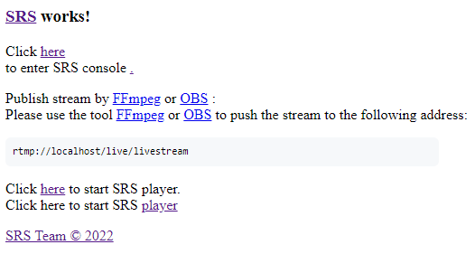

Si nos dirigimos al reproductor SRS, entonces obtenemos la siguiente página (traduciendola).

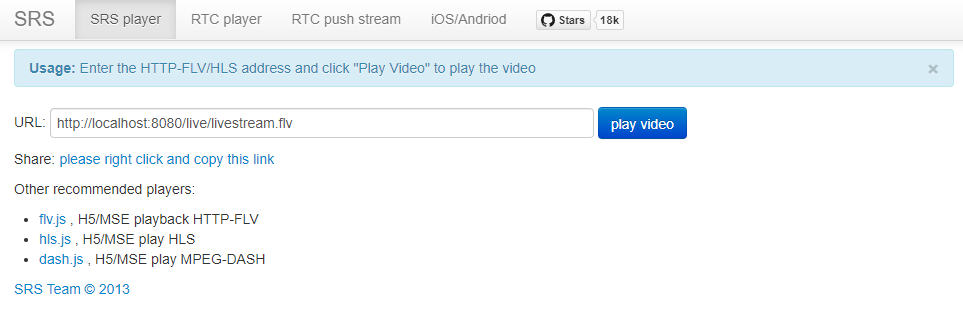

Reemplazando la URL por `http://$SERVER_IP:8080/app/mystream.flv`, pues nuestra llave de streaming es `mystream`, reproduciremos el streaming. En este caso estaríamos reproduciendo FLV.


### HLS

Accediendo a `http://$SERVER_IP:8080/app/mystream.m3u8`, obtenemos el archivo `.m3u8`, que nos permite reproducir el streaming. Una forma de probarlo es con la siguiente [App](https://hls-js.netlify.app/demo/). Usando el URL anterior:


### DASH

(TODO: Supuestamente desde la siguiente [App](http://reference.dashif.org/dash.js/nightly/samples/dash-if-reference-player/index.html) podríamos reproducir DASH, pero creo que no lo tengo configurado bien, o no estoy accediendo bien)

### WebRTC

(TODO: Creo que es Peer2Peer, pero tiene un conversor para soportarlo, los puertos están abiertos y todo. Llegué a poder probar el player inclusive - consiguiendo video - desde la WebApp de SRS)

# Grabación de la Sesión 
TODO
srs/trunk/objs/nginx/html/rec/app

# Codecs

## Soportados

(TODO: averiguar esto)

## Negociación de codec

Podemos observar los codecs utilizados durante el intercambio del protocolo `RTMP` con la herramienta `Wireshark`.

### Wireshark

(TODO: llenar con fotos)

# Intercambio de paquetes

En `Wireshark` podemos seguir una trama `RTMP` para observar el intercambio de paquetes entre cliente y servidor.

(TODO: seguir la trama en wireshark y ver el intercambio)

# Consola

Desde la Landing Page de SRS, podemos acceder a la consola, como habíamos visto antes. Dentro, nos encontramos con distintas visualizaciones.

## Resumen

Se puede observar el tiempo que lleva el servidor corriendo, así como el consumo de CPU, memoria y red.

Entre otros, se puede ver el ancho de banda de entrada y salida.

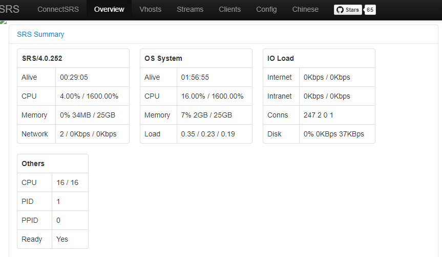

## VHosts

Se puede ver el ancho de banda intercambiado con cada host, junto con los streams abiertos.

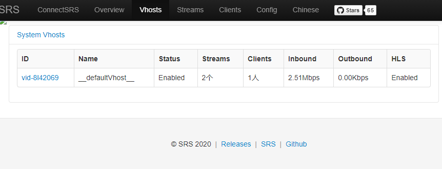

## Streams

Se pueden ver los distintos streams, así como los codecs utilizados y el ancho de banda compartido.

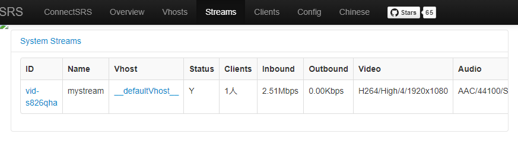

## Clients

Se pueden ver los distintos clientes, que pueden estar asociados a un mismo VHost.

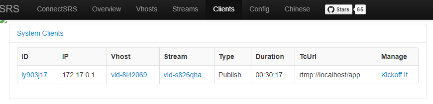

## Config

Se puede ver la configuración del servidor.

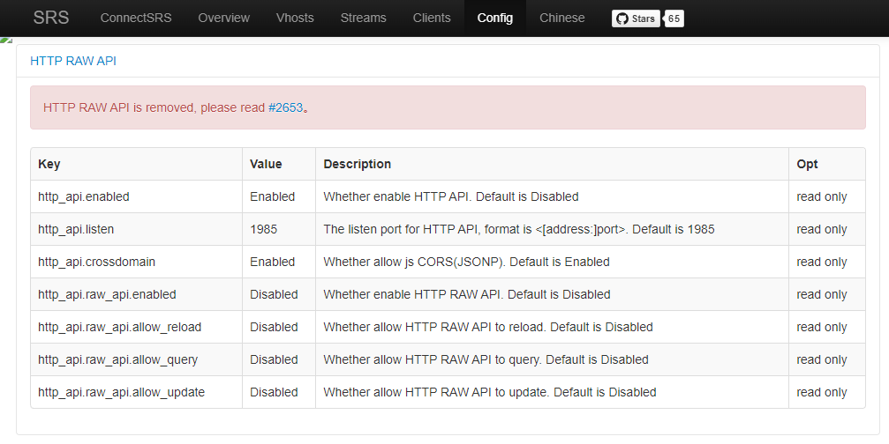