# AWS 
En caso de desear correr el server SRS en una instancia de EC2 se pueden seguir los siguientes pasos

## Configuración de EC2 

1. Dentro de la consola elegimos Lanzar una Instancia EC2 
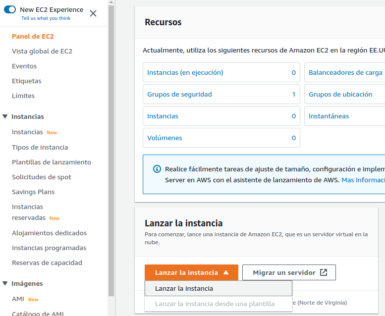

2. Configuramos el nombre 
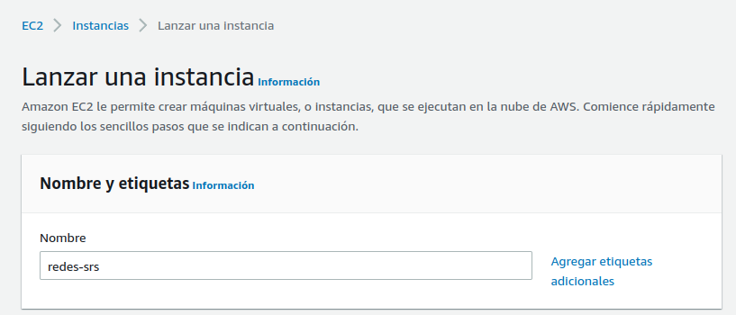

3. Elegimos una AMI de Ubuntu 
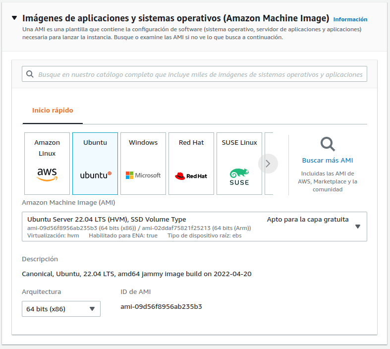

4. Elegimos el Tipo de Instancia  
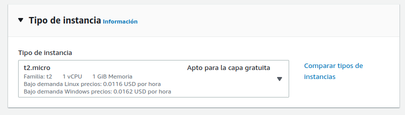

5. Creamos un par de keys para encriptar 
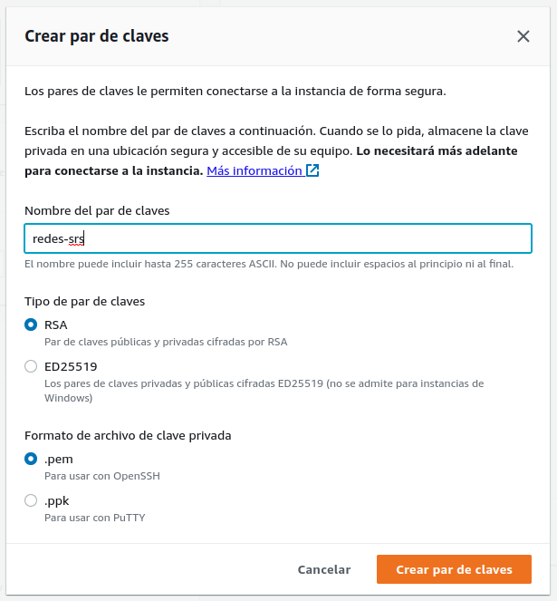

6. Configuramos el tráfico SSH
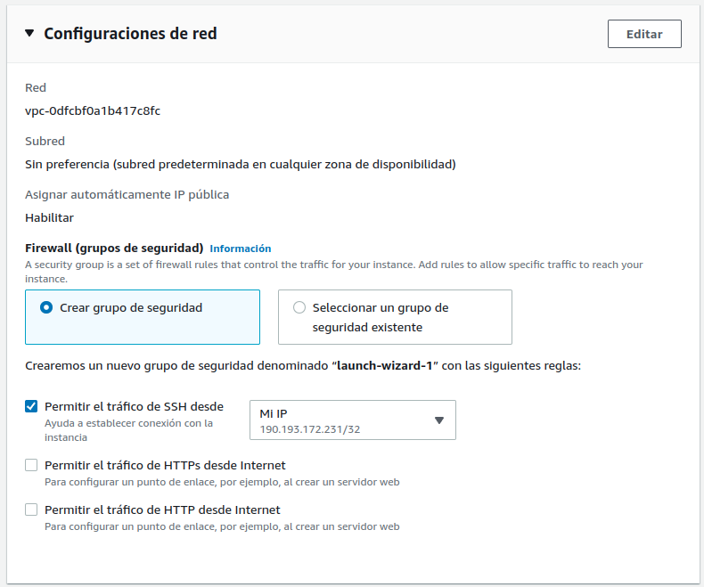

7. Configuramos los Security Groups para RTMP, Web App, Internal API y Web RTC 
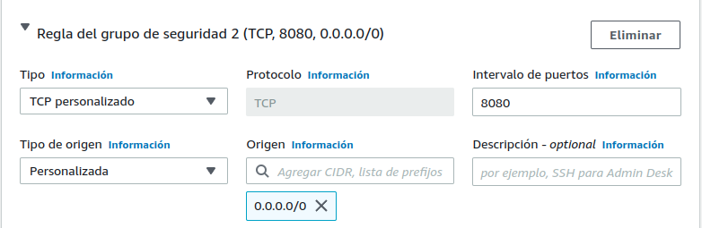
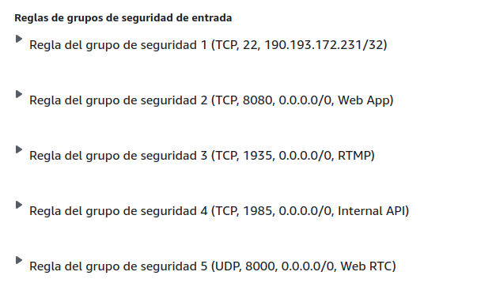

8. Ciframos con una llave de KMS 
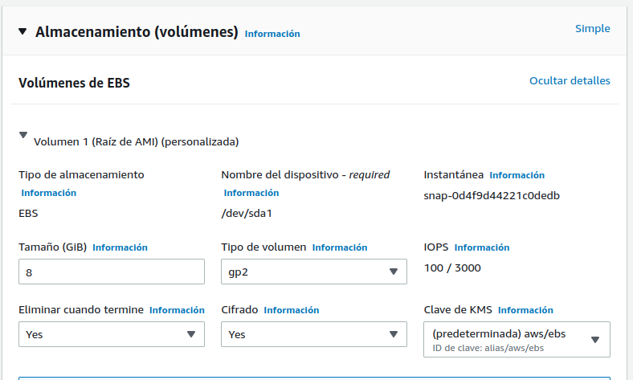

9. Habilitar Hibernate Behaviour
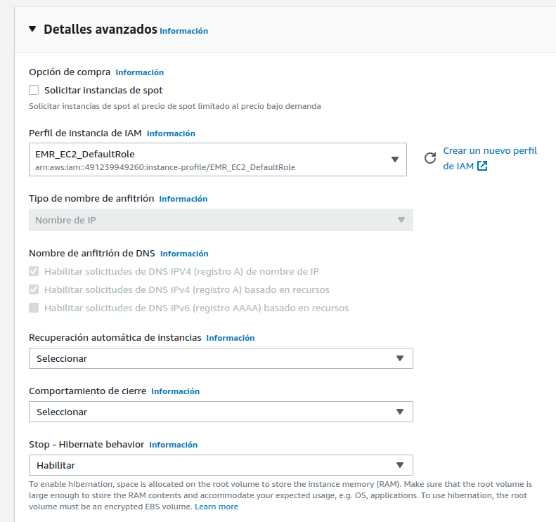

10. Ejecutar el server RTMP por User Data
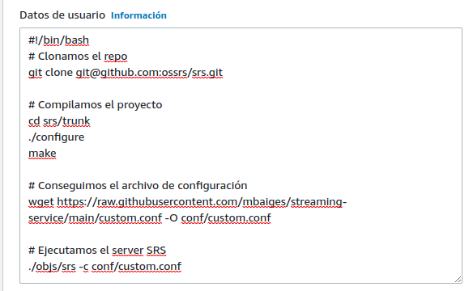